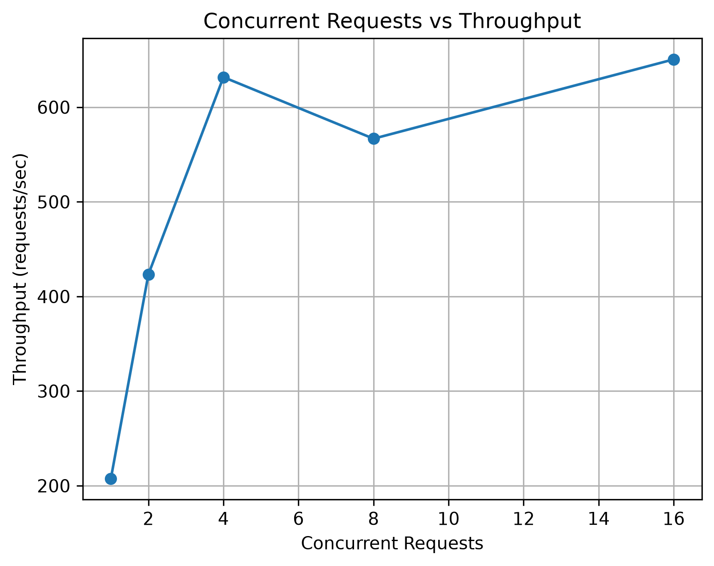

# Lost and Found Microservices Performance Analysis

A containerized Lost and Found application developed as a three-microservice system and evaluated under varying workloads.

## Project Overview

The application is divided into three independent services:

| Microservice | Responsibility | Host Port |
|---|---|---:|
| User Service | User-related operations | 8081 |
| Item Service | Lost and found item operations | 8082 |
| Handover Service | Item handover and return operations | 8083 |

Docker is used for containerization and Docker Compose is used to deploy the complete application. The three services communicate through a common Docker bridge network.

The Item Service is used as the main endpoint for workload testing.

## Architecture

```text
                         Client
                           |
                           v
                    +--------------+
                    | Item Service |
                    |    :8082     |
                    +--------------+
                      /          \
                     /            \
                    v              v
          +---------------+   +------------------+
          | User Service  |   | Handover Service |
          |     :8081     |   |      :8083       |
          +---------------+   +------------------+
                    \              /
                     \            /
                      +----------+
                      |  Docker  |
                      |  Network |
                      +----------+
```

The Item Service communicates with the other services using Docker service names:

```text
http://user-service/
http://handover-service/
```

This avoids using localhost for communication between containers.

## Technologies

| Technology | Purpose |
|---|---|
| PHP 8.2 | Microservice implementation |
| Apache | Web server |
| Docker | Containerization |
| Docker Compose | Multi-container deployment |
| Docker Bridge Network | Inter-service communication |
| ApacheBench | Workload generation |
| Python | Result processing |
| Pandas | Result data handling |
| Matplotlib | Graph generation |
| Git | Version control |
| GitHub | Repository hosting |

## Project Structure

```text
lostfound-microservices/
│
├── docker-compose.yml
├── generate_graphs.py
├── README.md
│
├── user-service/
│   ├── Dockerfile
│   └── index.php
│
├── item-service/
│   ├── Dockerfile
│   └── index.php
│
├── handover-service/
│   ├── Dockerfile
│   └── index.php
│
└── results/
    ├── workload_results.csv
    ├── response_time.png
    ├── throughput.png
    ├── cpu_utilization.png
    └── memory_utilization.png
```

## Microservice Implementation

### User Service

The User Service provides a REST endpoint for user-service verification.

```text
GET http://localhost:8081/
```

Example response:

```json
{
  "service": "User Service",
  "status": "running",
  "message": "User service is working"
}
```

### Item Service

The Item Service is the main service used for the experiment. It also demonstrates inter-service communication by contacting the User Service and Handover Service.

```text
GET http://localhost:8082/
```

### Handover Service

The Handover Service provides a REST endpoint for handover-service verification.

```text
GET http://localhost:8083/
```

Example response:

```json
{
  "service": "Handover Service",
  "status": "running",
  "message": "Handover service is working"
}
```

## Docker Configuration

Each microservice has its own Dockerfile.

```dockerfile
FROM php:8.2-apache

COPY index.php /var/www/html/index.php

EXPOSE 80
```

The three services are deployed using Docker Compose.

| Service | Container Name | Host Port | Container Port |
|---|---|---:|---:|
| User Service | lostfound-user | 8081 | 80 |
| Item Service | lostfound-item | 8082 | 80 |
| Handover Service | lostfound-handover | 8083 | 80 |

All three containers are connected to the Docker network:

```text
lostfound-network
```

## Deployment

Start the complete application with:

```powershell
docker compose up -d
```

Verify the running containers:

```powershell
docker ps
```

The expected containers are:

```text
lostfound-user
lostfound-item
lostfound-handover
```

Stop the application with:

```powershell
docker compose down
```

## REST API Verification

The three services can be accessed independently:

| Service | Endpoint |
|---|---|
| User Service | http://localhost:8081/ |
| Item Service | http://localhost:8082/ |
| Handover Service | http://localhost:8083/ |

## Inter-Service Communication

The Item Service performs requests to:

```text
http://user-service/
http://handover-service/
```

The final Item Service response contains the responses received from both services.

Example:

```json
{
  "service": "Item Service",
  "status": "running",
  "message": "Item service successfully communicated with other services",
  "user_service": {
    "service": "User Service",
    "status": "running",
    "message": "User service is working"
  },
  "handover_service": {
    "service": "Handover Service",
    "status": "running",
    "message": "Handover service is working"
  }
}
```

This confirms communication between the microservices through the Docker network.

## Workload Testing Method

ApacheBench was used to generate workload against the Item Service.

Test endpoint:

```text
http://localhost:8082/
```

Command format:

```powershell
& "C:\xampp2\apache\bin\ab.exe" -n 100 -c <concurrency> http://localhost:8082/
```

Each workload used 100 total requests.

The tested concurrency levels were:

| Workload | Concurrent Requests |
|---|---:|
| W1 | 1 |
| W2 | 2 |
| W3 | 4 |
| W4 | 8 |
| W5 | 16 |

Docker resource utilization was observed using Docker statistics during the workload tests.

## Measured Performance Results

The following values are the measured results from the experiment.

| Concurrent Requests | Avg Response Time (ms) | Throughput (req/s) | Failed Requests |
|---:|---:|---:|---:|
| 1 | 4.817 | 207.59 | 0 |
| 2 | 4.724 | 423.35 | 0 |
| 4 | 6.332 | 631.76 | 0 |
| 8 | 14.116 | 566.73 | 0 |
| 16 | 24.594 | 650.55 | 0 |

## Container Resource Measurements

| Concurrent Requests | Item CPU (%) | Item Memory (MiB) | Handover CPU (%) | Handover Memory (MiB) | User CPU (%) | User Memory (MiB) |
|---:|---:|---:|---:|---:|---:|---:|
| 1 | 0.00 | 16.72 | 0.01 | 18.84 | 0.01 | 16.17 |
| 2 | 0.01 | 16.26 | 0.01 | 19.08 | 0.01 | 16.90 |
| 4 | 0.01 | 16.41 | 0.01 | 19.55 | 0.01 | 17.39 |
| 8 | 0.01 | 16.57 | 0.01 | 20.27 | 0.01 | 17.61 |
| 16 | 0.01 | 16.51 | 0.01 | 20.50 | 0.01 | 18.08 |

## Performance Visualizations

### Average Response Time

The response-time graph shows the measured average response time for each concurrency level.


### Throughput

The throughput graph shows the measured number of requests processed per second at each concurrency level.



### CPU Utilization

The CPU graph compares the measured CPU utilization of the three containers.


### Memory Utilization

The memory graph compares memory usage across the three containers.


## Result Analysis

### Response Time

The average response time was low at the lower concurrency levels. It increased noticeably as the workload increased, reaching 24.594 ms at 16 concurrent requests.

| Concurrent Requests | Response Time |
|---:|---:|
| 1 | 4.817 ms |
| 2 | 4.724 ms |
| 4 | 6.332 ms |
| 8 | 14.116 ms |
| 16 | 24.594 ms |

The measurements show a clear increase in response time at higher concurrency.

### Throughput

Throughput increased from 207.59 req/s at one concurrent request to 631.76 req/s at four concurrent requests.

At eight concurrent requests, the measured throughput was 566.73 req/s. At sixteen concurrent requests, it increased to 650.55 req/s.

The variation demonstrates that throughput does not necessarily increase linearly with concurrency.

### Failed Requests

No failed requests were recorded at any of the five tested workload levels.

| Concurrent Requests | Failed Requests |
|---:|---:|
| 1 | 0 |
| 2 | 0 |
| 4 | 0 |
| 8 | 0 |
| 16 | 0 |

### CPU Utilization

CPU utilization remained very low throughout the experiment.

The recorded values were approximately 0.00–0.01% for the three services during the captured Docker statistics measurements.

### Memory Utilization

Memory usage remained relatively stable across the tested workloads.

At 16 concurrent requests:

| Service | Memory Usage |
|---|---:|
| Item Service | 16.51 MiB |
| Handover Service | 20.50 MiB |
| User Service | 18.08 MiB |

The Handover Service recorded the highest memory utilization in the measured observations.

## Result Files

The complete measured dataset is stored in:

```text
results/workload_results.csv
```

The generated visualizations are:

```text
results/response_time.png
results/throughput.png
results/cpu_utilization.png
results/memory_utilization.png
```

## Graph Generation

The graphs are generated using:

```text
generate_graphs.py
```

The script processes the workload CSV using Pandas and creates the four performance visualizations using Matplotlib.

To regenerate the graphs:

```powershell
python generate_graphs.py
```

## Verification Commands

Check running containers:

```powershell
docker ps
```

Check Docker images:

```powershell
docker images
```

Check Docker networks:

```powershell
docker network ls
```

Start the application:

```powershell
docker compose up -d
```

Stop the application:

```powershell
docker compose down
```

## Experiment Outcome

The three microservices were developed and independently containerized. Docker Compose was used to deploy the complete application, and a shared Docker network enabled communication between the services.

The Item Service successfully communicated with both the User Service and Handover Service using Docker service names.

Five workload levels were evaluated using ApacheBench. Response time, throughput, failed requests, CPU utilization, and memory utilization were recorded for the experiment.

The measurements show that response time generally increases as concurrency increases. Throughput increased at lower workload levels and varied at higher concurrency. No failed requests were observed during the tested workloads. CPU utilization remained very low, while memory utilization remained comparatively stable.

The experiment therefore demonstrates the complete process of developing, containerizing, deploying, connecting, load testing, monitoring, and analyzing a containerized microservice application.

## Repository

GitHub:

https://github.com/sunayanakamat04/lostfound-microservices
